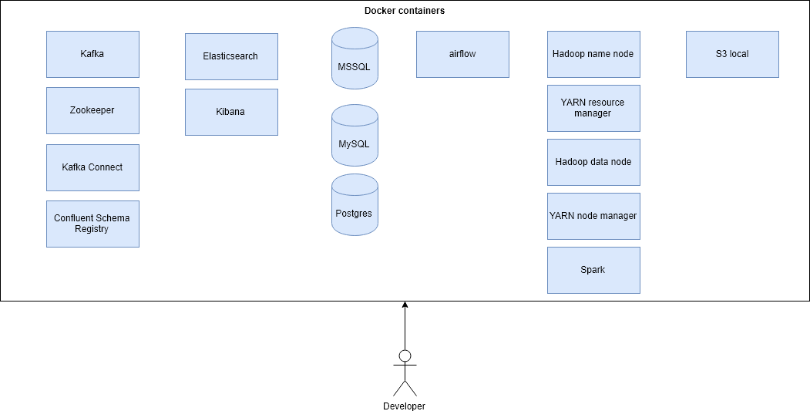

# big-data-dev-environment-docker
Big Data development environment based on Docker.

# Run

Run environment with command:

    docker-compose up
    
You can run selected services by specifying names in the end, for example to run PostgreSQL and Elasticsearch run:

    docker-compose up postgres elasticsearch 
    
# Bind mounts

## Airflow dags

Airflow dags can be copied on host to directory [dags](/dags), so that they will be visible inside Docker container with airflow. 

## Spark applications

Spark applications can be copied to directory [spark-jobs](/spark-jobs), so that they will be visible inside Docker container with Spark at `/opt/transformations` directory.

## Kafka Connect JDBC drivers

If you want to add new JDBC drivers to Kafka Connect you can copy them locally to directory [kafka-connect-jdbc](/kafka-connect-jdbc).

# Examples

- [How to connect to local S3 with S3 browser](/examples/example-s3-browser)
- [How to integrate Java AWS SDK API with fake S3](/examples/example-java-s3-local)
- [How to integrate Spark with local Hadoop](/examples/example-spark-hdfs)
- [How to connect from AWS CLI to local Dynamo DB](/examples/example-dynamodb-with-awscli)
- [How to integrate Java AWS SDK API with local Dynamo DB](/examples/example-java-dynamodb-local)