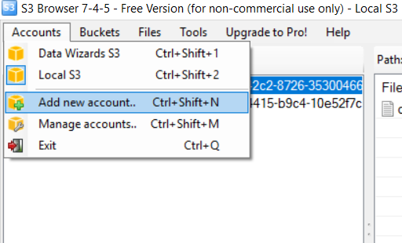
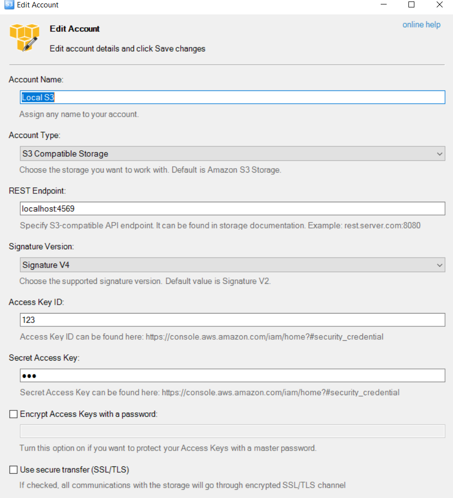

# Connect to local S3 with S3 browser

Instruction how to connect to local S3 with S3 browser.

## Prerequisites

Start Docker container with local S3:

    docker-compose up s3

## Instruction 

Add new account:

Provide settings:

- REST endpoint: localhost:4569
- Access key and secret access key - any values

